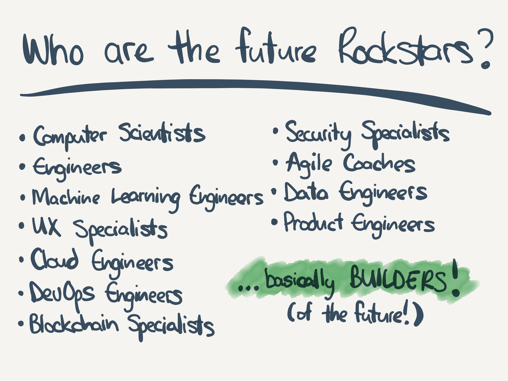

# Project Rockstar - the MAIN hustle

This repo holds additional information & background to the *"Project Rockstar - the MAIN hustle"* proposal, submitted for *Fund 6 of Project Catalyst*.

## Description

A gig platform to foster and fuel high-demand and highly-skilled talent, inverting the power dynamic between employers and individuals. Not a traditional "microlending" model, but rather a decentralised "investment" model - where talented individuals can raise funds to further their own careers through training and tech equipment (laptop, etc). "Time-tokens" are issued by each individual fund raising smart contract, allowing for voting & distribution of funds to individuals as needed.

## Draft pitch deck

## Background, history and idea

I have been thinking about this particular problem for a number of years, and had a few attempts at trying to rally support, fund and build something to solve this. Originally, I named this "Project FutureTeam" - and it was a centralised platform for hiring and building development teams on a time & materials basis, but using a video interface for actual delivery of time & value delivered bi-directionally. I was inspired by the model presented by "SpankChain" at DevCon 2017 - using a dApp to connect video, using WebRTC, and at the same time opening an Ethereum Raiden payment channel in the reverse direction. This model allows the "trickle" of funds to an individual based on the time spent connected to the video channel. This idea inspired me to re-consider the "future of work" for highly skilled individuals, such as software developers, engineers, lawyers, teachers, even doctors - allowing the consuming of these professional individuals time from anywhere in the world, without any centralised payment infrastructure. E.g. a Zoom platform, but with a payment channel. It is still unbelievable to me that this still does not exist - but I think the reason is that the general day-to-day online consumer is not yet digital currency savvy - and why not? Well the old world works OK, and there is not enough of a critical mass to drive the adoption yet.

So I thought about this problem from another angle, how do we drive adoption of digital currencies, and therefore decentralised smart-contracts for everything. The problem begins with the fact that most people have their money in their own bank accounts, accessible via various means such as credit/debit cards, mobile payment mechanisms, etc. But the anchor is really the fact that funds are held in bank accounts, and why are they there, well it's because salaries & wages are generally paid into bank accounts. So the root of my frustration really boils down to employer / employee financial relationships. If we could get employers to pay salaries into decentralised wallets, then individuals would be more comfortable making use of those wallets for paying for stuff, and I believe adoption would follow quickly as service providers would then have incentive to build more and more smart contracts for accessing those consumer funds more directly.

So, Project Rockstar is born out of this idea of getting to the origin of the funds, building a new mechanism for "employment" through a combination of crowd-funding, but also a distributed autonomous organisation (DAO), backing each of the potential "Rockstars". Historically, potentially talented individuals would have to raise funds through family, friends and institutions for training and education - often putting those individuals into large amounts of debt in order to realise their talents. With Project Rockstar, they would be able to rather "attract investors" into their lives, raising capital to allow them to invest in the necessary training, education, equipment and living costs associated with being a young professional - but then also having a collection of "backers / mentors" through this same mechanism who are themselves invested in the success of the individual. Investors, based on succesful funding, would receive "time tokens" redeemable either through "cancelling" them (receiving a proportionate amount of funds held in the contract), or through actual work performed by the principle individual, and redeemed on potentially an hour, daily or weekly basis. Tokens can be freely traded on the open market, but should benefit the principle individual on each trade - through a small margin. This tradeability is critical to the success of the model - as particular investors may be speculative, rather than long-term, and thus mechanism would allow them go long on "machine learning" for example, and because the market value of the individuals hour, day or weekly rate would attract a higher future price - allows the investor to sell at the higher rate into the future with low friction.

I think it's a very powerful idea, re-inventing the very idea of "employment" itself - and reversing the power-balance between institution and individual.

## About me

My name is Tom Wells, and I am a bit of a "couch de-centralist", having discovered and mined a few bitcoins (using my CPU!!) in 2011, and then discovering the disruptive potential of smart-contracts on the Ethereum blockchain as far back as 2016. I was very fortunate to be able to attend DevCon in Prague in 2018, meeting Vitalik briefly, but also cementing my vision in this "brave new world" of decentralisation. Since then, I try to evangelise decentralisation as much as possible, and encourage my software engineering collegues to become "Incentive Engineers" - a term (I may have been the first to?) coin a few years ago describing the central essence of how software must be developed in the future - making use of game theory and individual maximalism - a powerful force in system design. 

In my professional life I am "Chief Disruption Officer" of a company called Synthesis Software Technologies, based in South Africa, of which I am fortunate enough to have co-founded along with some other very smart folks in 2004. Today my role is looking at emerging technologies such as blockchain, distributed system architectures, machine learning, cloud and hyper-scale. I am a skilled functional programmer, able to build enterprise grade web and mobile platforms using Haskell, PureScript, JavaScript, Scala and many other "mainstream" languages such as C/C++, C# & Java. You can checkout my blog at https://tomwells.org where I post links to all my videos & articles collected over the years.

I have also been very fortunate to have been selected to take part of *Cohort 2 of the Plutus Pioneers Program* - which is currently underway and presented by the talented Lars Brünjes of IOHK. We are currently on Lecture #8, and at this stage I would say I understand the overall model of Plutus, including the eUTXO model pretty well. Luckily my Haskell / PureScript background means I have been fortunate enough to not struggle with the programming language as much as others might have - so although the content is rich & deep, I haven't had to spend much time on homework over the course of the program.